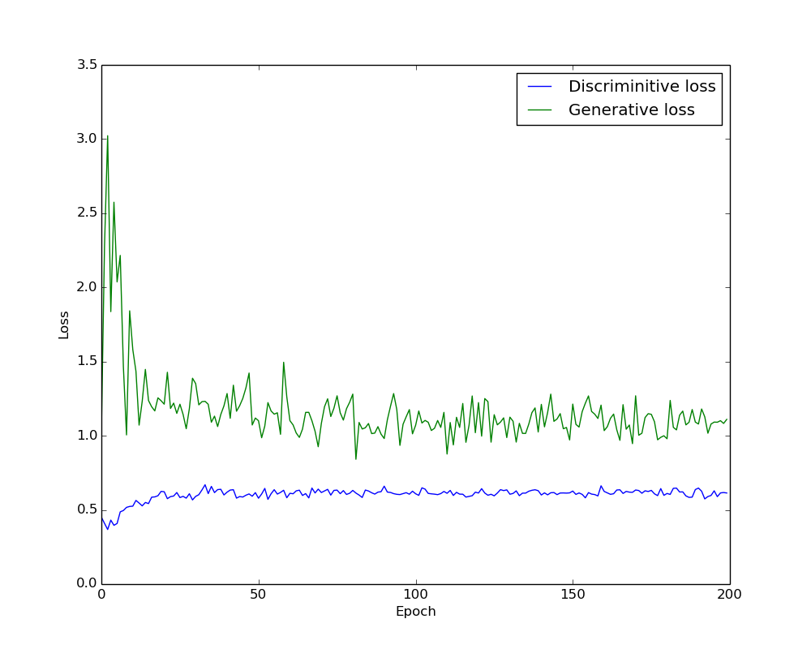

# Keras GAN for MNIST

Simple and straightforward Generative Adverserial Network (GAN) implementations using the [Keras](https://keras.io/ "Keras") library.  
Several of the tricks from [ganhacks](https://github.com/soumith/ganhacks) have already been implemented.

`mnist_dcgan.py`: a Deep Convolutional Generative Adverserial Network (DCGAN) implementation.  
Each epoch takes approx. 1 minute on a NVIDIA Tesla K80 GPU (using Amazon EC2).  
Generated images after 50 epochs can be seen below.

`mnist_gan.py`: a standard GAN using fully connected layers.
Each epoch takes ~10 seconds on a NVIDIA Tesla K80 GPU.  
Generated images after 200 epochs can be seen below.

## DCGAN

  
[Generated MNIST images at epoch 50.]

  
[Loss at every epoch for 50 epochs.]

## Deep GAN

  
[Generated MNIST images at epoch 200.]

  
[Loss at every epoch for 200 epochs.]

